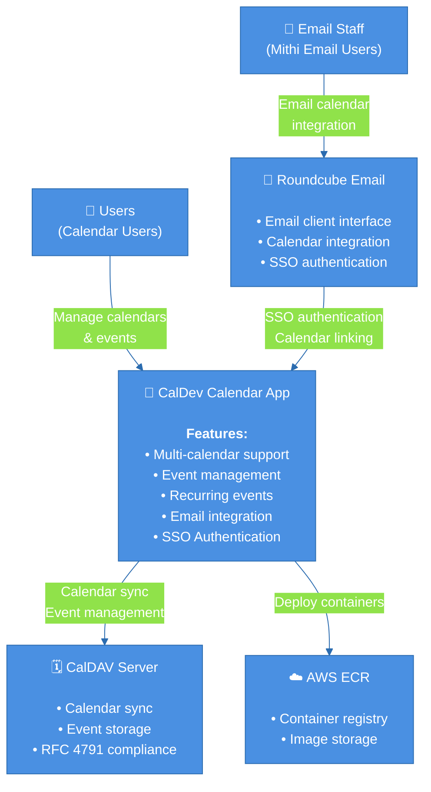
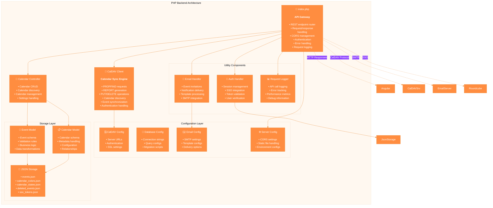
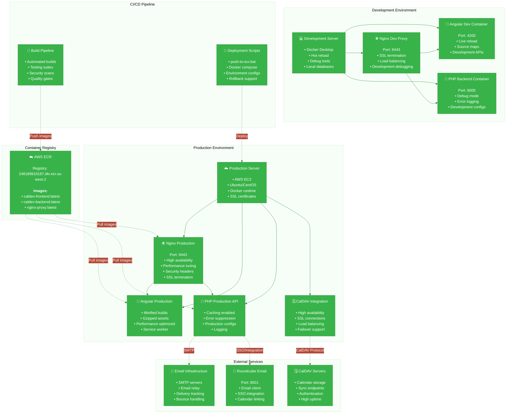
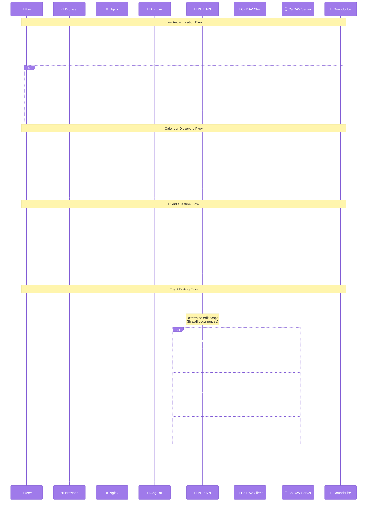

# CalDev Calendar Application - C4 Architecture Diagrams

## 1. System Context Diagram (Level 1)



## 2. Container Diagram (Level 2)

```mermaid
%%{init: {'theme':'base', 'themeVariables': {'primaryColor': '#4A90E2', 'primaryTextColor': '#FFFFFF', 'primaryBorderColor': '#2B6CB0', 'lineColor': '#2B6CB0', 'backgroundColor': '#FFFFFF', 'tertiaryColor': '#F7FAFC'}}}%%
graph TB
    subgraph "Browser"
        Browser["🌐 Web Browser<br/><br/>• Angular SPA<br/>• User interface<br/>• Local storage"]
    end
    
    subgraph "CalDev Application"
        Nginx["🔄 Nginx Proxy<br/><br/>• SSL termination<br/>• Load balancing<br/>• Static files"]
        
        Angular["📱 Angular Frontend<br/><br/><b>Technologies:</b><br/>• Angular 17<br/>• TypeScript<br/>• RxJS<br/>• Tailwind CSS<br/><br/><b>Features:</b><br/>• Component-based UI<br/>• Reactive forms<br/>• State management<br/>• Offline support"]
        
        PHApi["🔧 PHP Backend API<br/><br/><b>Technologies:</b><br/>• PHP 8.0+<br/>• Apache/Nginx<br/>• RESTful API<br/><br/><b>Features:</b><br/>• Event management<br/>• Calendar sync<br/>• Authentication<br/>• Email integration"]
        
        CalDAVClient["📡 CalDAV Client<br/><br/>• RFC 4791 compliance<br/>• Calendar discovery<br/>• Event CRUD<br/>• Recurrence handling"]
    end
    
    subgraph "External Systems"
        RDCMail["📧 Roundcube Mail<br/><br/>• Email client<br/>• SSO provider<br/>• Calendar integration"]
        
        CalDAVSrv["🗓️ CalDAV Server<br/><br/>• Calendar storage<br/>• Event persistence<br/>• Sync protocol"]
        
        SMTP["📤 SMTP Server<br/><br/>• Email delivery<br/>• Event invitations"]
    end
    
    subgraph "Storage"
        JSONData["📄 JSON Files<br/><br/>• Events storage<br/>• Calendar configs<br/>• User preferences<br/>• Color mappings"]
        
        LocalStorage["💾 Browser Storage<br/><br/>• User sessions<br/>• UI preferences<br/>• Calendar colors<br/>• Offline data"]
    end
    
    subgraph "Infrastructure"
        Docker["🐳 Docker Containers<br/><br/>• Container orchestration<br/>• Service isolation<br/>• Environment management"]
        
        AWS["☁️ AWS ECR<br/><br/>• Container registry<br/>• Image deployment<br/>• CI/CD pipeline"]
    end
    
    %% Connections
    Browser <-->|"HTTPS/API calls"| Nginx
    Nginx --> Angular
    Angular <-->|"REST API"| PHApi
    PHApi --> CalDAVClient
    CalDAVClient <-->|"CalDAV protocol"| CalDAVSrv
    
    PHApi <-->|"SSO integration"| RDCMail
    PHApi --> SMTP
    
    PHApi --> JSONData
    Angular --> LocalStorage
    
    Docker -.->|"Deploy"| AWS
    Angular -.-> Docker
    PHApi -.-> Docker
    Nginx -.-> Docker
```

## 3. Component Diagram - Angular Frontend (Level 3)

```mermaid
%%{init: {'theme':'base', 'themeVariables': {'primaryColor': '#4A90E2', 'primaryTextColor': '#FFFFFF', 'primaryBorderColor': '#2B6CB0', 'lineColor': '#2B6CB0', 'backgroundColor': '#FFFFFF', 'tertiaryColor': '#F7FAFC'}}}%%
graph TB
    subgraph "Angular Frontend Components"
        AppComponent["🎯 App Component<br/><br/>• Root component<br/>• Layout management<br/>• Route handling"]
        
        CalendarComponent["📅 Calendar Component<br/><br/><b>Features:</b><br/>• Multiple views (Day/Week/Month)<br/>• Event CRUD operations<br/>• Calendar filtering<br/>• Search functionality<br/>• Agenda view<br/><br/><b>Responsibilities:</b><br/>• Events management<br/>• View switching<br/>• Calendar state<br/>• User interactions"]
        
        DayViewComponent["📊 Day View<br/><br/>• Daily event grid<br/>• Time-based layout<br/>• Event details"]
        
        WeekViewComponent["📈 Week View<br/><br/>• 7-day grid<br/>• Event positioning<br/>• Time slots"]
        
        MonthViewComponent["🗓️ Month View<br/><br/>• Calendar grid<br/>• Multiple weeks<br/>• Event indicators"]
        
        EventDetailModal["📝 Event Detail Modal<br/><br/>• Event creation/editing<br/>• Form validation<br/>• Recurrence settings<br/>• Attendee management<br/>• Calendar selection"]
        
        RecurringDeleteModal["❌ Recurring Delete Modal<br/><br/>• Instance vs series<br/>• Confirmation dialogs<br/>• Delete actions"]
        
        LoginComponent["🔐 Login Component<br/><br/>• Authentication UI<br/>• Credential input<br/>• SSO integration"]
        
        ReminderNotification["🔔 Reminder Component<br/><br/>• Event notifications<br/>• Time-based alerts<br/>• User preferences"]
        
        ExportModal["📤 Export Modal<br/><br/>• Calendar export<br/>• Multiple formats<br/>• Date range selection"]
        
        ImportModal["📥 Import Modal<br/><br/>• Calendar import<br/>• File validation<br/>• Conflict resolution"]
        
        DateNavigation["📆 Date Navigation<br/><br/>• Date selection<br/>• Range controls<br/>• Quick navigation"]
    end
    
    subgraph "Angular Services"
        ApiService["🌐 API Service<br/><br/>• HTTP client<br/>• REST endpoints<br/>• Error handling<br/>• Response mapping"]
        
        AuthService["🔑 Auth Service<br/><br/>• User authentication<br/>• Session management<br/>• SSO integration<br/>• Route guards"]
        
        EmailService["✉️ Email Service<br/><br/>• Event invitations<br/>• SMTP integration<br/>• Template handling"]
        
        ColorRegistryService["🎨 Color Registry<br/><br/>• Calendar colors<br/>• Color mapping<br/>• Consistency<br/>• Customization"]
        
        RecurrenceExpansionService["♻️ Recurrence Service<br/><br/>• RRULE parsing<br/>• Event expansion<br/>• Instance generation<br/>• EXDATE handling"]
    end
    
    subgraph "Angular Guards & Interfaces"
        AuthGuard["🛡️ Auth Guard<br/><br/>• Route protection<br/>• Access control<br/>• Redirect logic"]
        
        CalendarEventInterface["📋 Calendar Event Interface<br/><br/>• Type definitions<br/>• Data contracts<br/>• Validation rules"]
        
        SortPipe["🔀 Sort Pipe<br/><br/>• Event sorting<br/>• Time-based ordering<br/>• Custom comparators"]
    end
    
    %% Component relationships
    AppComponent --> CalendarComponent
    AppComponent --> LoginComponent
    AppComponent --> AuthGuard
    
    CalendarComponent --> DayViewComponent
    CalendarComponent --> WeekViewComponent
    CalendarComponent --> MonthViewComponent
    CalendarComponent --> EventDetailModal
    CalendarComponent --> RecurringDeleteModal
    CalendarComponent --> ReminderNotification
    CalendarComponent --> ExportModal
    CalendarComponent --> ImportModal
    CalendarComponent --> DateNavigation
    
    %% Service dependencies
    CalendarComponent -.-> ApiService
    CalendarComponent -.-> AuthService
    CalendarComponent -.-> EmailService
    CalendarComponent -.-> ColorRegistryService
    CalendarComponent -.-> RecurrenceExpansionService
    
    EventDetailModal -.-> ApiService
    EventDetailModal -.-> EmailService
    EventDetailModal -.-> RecurrenceExpansionService
    
    LoginComponent -.-> AuthService
    
    %% Interfaces and pipes
    CalendarComponent -.-> CalendarEventInterface
    CalendarComponent -.-> SortPipe
```



## 4. Component Diagram - PHP Backend (Level 3)



## 5. Deployment Diagram (Level 4)



## 6. User Interaction Flow Diagram



## Architecture Summary

### Technology Stack

**Frontend:**
- Angular 17 with TypeScript
- RxJS for reactive programming
- Day.js for date manipulation
- Tailwind CSS for styling
- Angular standalone components
- RxJS observables for state management

**Backend:**
- PHP 8.0+ with Apache/Nginx
- RESTful API architecture
- CalDAV protocol implementation
- JSON file storage
- Session-based authentication
- SSO integration with Roundcube

**Infrastructure:**
- Docker containerization
- AWS ECR for image registry
- Nginx reverse proxy
- SSL/HTTPS termination
- Multi-environment support (dev/prod)

### Key Features

**Calendar Management:**
- Multi-calendar support
- Calendar discovery via CalDAV
- Custom calendar colors
- Calendar filtering and search

**Event Management:**
- Full CRUD operations
- Recurring event support (RRULE)
- Event exceptions (EXDATE)
- All-day event support
- Event reminders

**User Experience:**
- Multiple views (Day/Week/Month/Agenda)
- Responsive design
- Offline capabilities
- Export/import functionality
- Email invitation integration

**Integration:**
- CalDAV protocol compliance
- Roundcube email client integration
- SMTP for email notifications
- SSO authentication support

### Deployment Strategy

**Development:**
- Docker Compose with hot reload
- Local development services
- Debug-enabled configurations
- Live testing environment

**Production:**
- Multi-container deployment
- AWS ECR image management
- Automated CI/CD pipeline
- SSL termination and security
- High availability setup

### Security Features

- CORS configuration
- SSL/HTTPS encryption
- Session-based authentication
- SSO integration
- Input validation
- Error handling and logging
